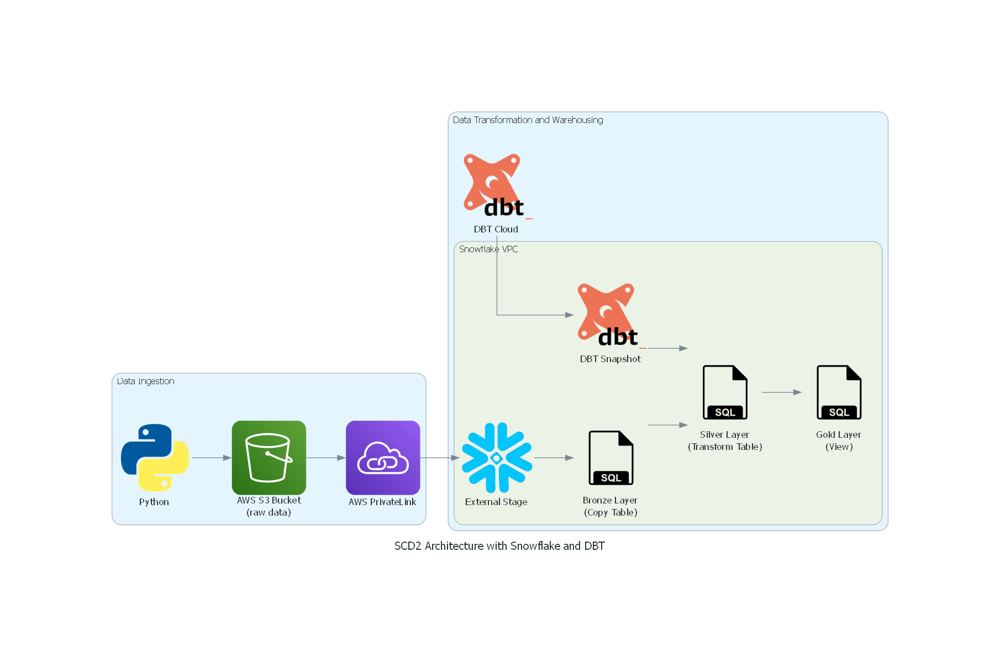

# 🧱 ETL with Slowly Changing Dimension Type 2 (SCD2) using DBT & Snowflake

This project showcases a modular ETL pipeline that loads `.csv` files from AWS S3 into Snowflake and applies **SCD Type 2** logic using **DBT models and Snapshots**, capturing historical changes across dimension tables.

---

## 🧩 Architecture Overview


1. **Raw Data Upload**  
   - Files are dropped into an S3 bucket  
   - Managed using a Python script or automated service

2. **AWS PrivateLink**  
   - Securely routes S3 traffic into Snowflake

3. **Snowflake Configuration**  
   - **External Stage**: Reads files from S3  
   - **Bronze Layer**: Raw data loaded via `COPY INTO`  
   - **Silver Layer**: Cleaned and modeled data  
   - **Snapshots**: Track changes across time using surrogate keys and date ranges  
   - **Gold Layer**: Final reporting views

---

## 🔧 Tech Stack

- **Python** – Upload `.csv` files to S3
- **Amazon S3** – Stores raw input files
- **Snowflake**  
  - **External Stage** – Reads files from S3  
  - **Warehouse** – Performs transformations and queries
- **DBT (Data Build Tool)**  
  - **Models** – Define Bronze, Silver, and Gold layers  
  - **Snapshots** – Implement SCD Type 2 tracking logic  
  - **Tests** – Validate assumptions and data integrity

---

## 📂 Repository Structure

```
ETL-SCD2-USING-DBT-SNOWFLAKE/
│
├── analyses/ → (Optional) Directory for ad hoc SQL analysis or documentation
├── diagrams/
│ ├── Diagram Generator/
│ │ └── architecture.py → Python script to generate the architecture diagram
│ └── architecture.png → Visual representation of the data pipeline
│
├── macros/
│ ├── copy_into_snowflake.sql → Custom macro to load data into Snowflake tables
│ ├── generate_schema_name.sql → Dynamically sets schema names based on environment
│ └── query_tag.sql → Tags queries for better observability and debugging
│
├── models/
│ ├── gold/
│ │ └── product_view.sql → Final business layer with cleaned, historical data
│ └── silver/
│ ├── schema.yml → Describes metadata and tests for silver models
│ └── transform_product_load.sql → Applies SCD2 transformations to raw data
│
├── python/
│ └── local_to_aws_s3.py → Python script to upload data from local to AWS S3
│
├── seeds/
│ └── Product_Dim.csv → Seed file used to populate static/starter dimension data
│
├── snapshots/
│ └── product_snapshot.sql → Snapshot definition for SCD2 logic in DBT
│
├── snowflake/
│ └── SnowflakeSetup.sql → Creates stage, tables, and roles in Snowflake
│
├── target/ → DBT-generated compiled code and artifacts (ignored from version control)
│
├── tests/
│ ├── Product_Dim_1.csv → Test input file for verifying snapshot logic
│ └── Product_Dim.csv → Another variant of test dimension data
│
├── .gitignore → Files and folders to exclude from git tracking
├── dbt_project.yml → Core DBT project configuration file
├── package-lock.yml → Lockfile for consistent package installations
├── packages.yml → DBT package dependencies
└── README.md → Project documentation and setup instructions
```

---

## ▶️ How It Works

1. ☁️ Upload `Product_Dim.csv` to the S3 bucket  
   (optionally via Python, UI, or automation)

2. ❄️ In Snowflake:
    - Create a stage and load the file to the Bronze table using `COPY INTO`

3. 🧱 With DBT:
    - Define transformation models across Bronze, Silver, and Gold layers
    - Use `dbt snapshot` to track historical changes in the Silver layer

4. 🔁 DBT Snapshot Logic:
    - Creates new records when non-key fields change
    - Maintains history with `valid_from`, `valid_to`, and `is_current` flags

---

## ✅ Highlights

- Modular, layered architecture (Bronze → Silver → Gold)
- Real-world implementation of DBT Snapshots for SCD2
- Secure ingestion from AWS S3 using Snowflake stages
- Analytical reporting support via clean Gold layer views

---

## 🏷️ Tags & Topics
```
Use these hashtags when sharing the project:
#DataEngineering #Snowflake #SCD2 #ETL #DBT #AWS #S3 #Snapshots #DataModeling #Analytics #DataPipeline #CloudWarehouse

```
